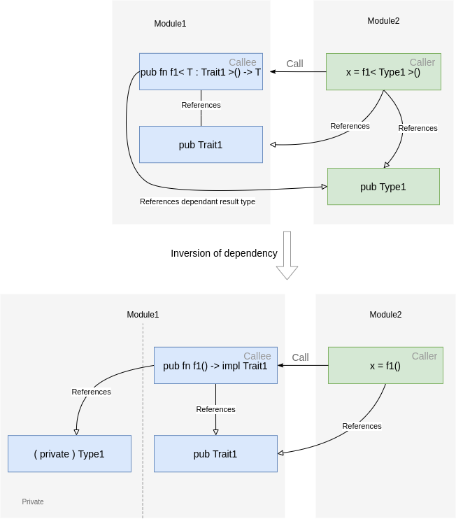

# Inversion of Dependencies of a Function in Rust

Investigating Capability of Rust I encountered a problem that helped me to understand meaning of [parameterization with `impl Trait`](https://doc.rust-lang.org/reference/types/impl-trait.html). The primary purpose of that is an inversion of dependencies.



Let’s assume we have the problem:

```rust

pub struct VectorFormer< ContainerEnd >
where
  ContainerEnd : Fn(),
{
  on_end : ContainerEnd,
}

//

impl< ContainerEnd > VectorFormer< ContainerEnd >
where
  ContainerEnd : Fn(),
{
  fn new( on_end : ContainerEnd ) -> Self
  {
    Self { on_end }
  }
}

//

pub struct CommandFormer
{
}

//

impl CommandFormer
{

  pub fn problem< ContainerEnd >() -> VectorFormer< ContainerEnd >
  where
    ContainerEnd : Fn()
  {
    let on_end = ||
    {
      println!( "on_end" );
    };
    VectorFormer::< ContainerEnd >::new( on_end )
  }

}
```
[Code](https://github.com/Wandalen/RustPractice/tree/master/all/problem_closure_passproblem_1.rs)
[Playground](https://play.rust-lang.org/?version=stable&mode=debug&edition=2021&gist=9ac555eff38566ea31c08349a7090bc9)

It gives this error:

```log
  --> src/problem1.rs:46:42
   |
38 |     pub fn problem< ContainerEnd >() -> VectorFormer< ContainerEnd >
   |                     ------------ this type parameter
...
42 |       let on_end = ||
   |  __________________-
43 | |     {
44 | |       println!( "on_end" );
45 | |     };
   | |_____- the found closure
46 |       VectorFormer::< ContainerEnd >::new( on_end )
   |                                            ^^^^^^ expected type parameter `ContainerEnd`, found closure
   |
   = note: expected type parameter `ContainerEnd`
                     found closure `[closure@src/problem1.rs:42:18: 45:6]`
   = help: every closure has a distinct type and so could not always match the caller-chosen type of parameter `ContainerEnd`
```

That is quite useless because understanding that every closure has its own type does not fix the problem.

What is helpful in reducing the problem to a simpler problem without closures:

```rust
impl CommandFormer
{

  pub fn problem< ContainerEnd >() -> VectorFormer< ContainerEnd >
  where
    ContainerEnd : Display
  {
    let on_end = 13;
    VectorFormer::< ContainerEnd >::new( on_end )
  }

}
```
[Code](https://github.com/Wandalen/RustPractice/tree/master/all/problem_closure_passsolution_2.rs)
[Playground](https://play.rust-lang.org/?version=stable&mode=debug&edition=2021&gist=aa5153eca7c04c4dc3fcb0e4b6fef438)

Now it's clear that instead of type, the returned entity is bound only by the trait alias `ContainerEnd`. Replacing `ContainerEnd` by a type can fix the problem:

```rust

impl CommandFormer
{

  pub fn problem() -> VectorFormer< i32 >
  {
    VectorFormer::< i32 >::new( 13 )
  }

}
```
[Code](https://github.com/Wandalen/RustPractice/tree/master/all/problem_closure_passsolution_2.rs)
[Playground](https://play.rust-lang.org/?version=stable&mode=debug&edition=2021&gist=f28007017383b8abc5cc54f687c8745f)

But what about fixing the original problem? Is this solution enough? Not really. The simplified problem type is known and has the global name `i32`, but each closure has its own type. Luckily, there is a way to bound the result type, but keep control over the type internally in the function. Parametrization of the result type with `impl Trait` solves the problem.

```rust

impl CommandFormer
{

  pub fn problem() -> VectorFormer< impl Fn() >
  {
    let on_end = ||
    {
      println!( "on_end" );
    };
    VectorFormer::new( on_end )
  }

}

```
[Code](https://github.com/Wandalen/RustPractice/tree/master/all/problem_closure_passsolution.rs)
[Playground](https://play.rust-lang.org/?version=stable&mode=debug&edition=2021&gist=5b4bf65c85d527b81e412a9d12a22a39)

That works. But why? Is not `impl Trait` a form of parametrizing a function equivalent? It is, but not identical. A generic argument/parameter type is an input type, just like a function argument is an input to the function. If you try to return a closure using a type that is generic, that is like calling a function like sin() and insisting that it always returns e.g. 0. That is something the compiler currently can’t do — you can't constrain what value a function returns for a specific argument, nobody and nothing other than the function itself decides that.

Here, since your function itself defines the closure to be returned, it unambiguously determines its type for itself, and there is no way in the world you can force it to be a different type. Therefore, using a generic type parameter, an input type, doesn't make sense and isn't allowed.

The return-position impl Trait syntax is nothing like generics. It specifies an output at the type level. It says that "this value has a type that promises to implement Trait, but you aren't allowed to know or prescribe what this concrete type is".

### Comparison of 3 Alternative Forms of Generic Parameterization

Let’s dig into differences and similarities of alternative forms a bit deeper.

```rust

fn main()
{
  f1::< i32, i32 >( 13, 14 );
  f2::< i32, i32 >( 13, 14 );
  // ! f3::< i32, i32 >( 13, 14 );
  // <! explicit generic argument not allowed

  f1( 13, 14 );
  f2( 13, 14 );
  f3( 13, 14 );
}

//

fn f1< A : Display + PartialEq, B : Display >( a : A, b : B )
{
  println!( "{} {} {}", a, b, a == a );
}

//

fn f2< A, B >( a : A, b : B )
where
  A : Display + PartialEq,
  B : Display,
{
  println!( "{} {} {}", a, b, a == a );
}

//

fn f3( a : impl Display + PartialEq, b : impl Display )
{
  println!( "{} {} {}", a, b, a == a );
}
```

[Code](https://github.com/Wandalen/RustPractice/tree/master/all/problem_closure_passparameter_difference_1.rs)
[Playground](https://play.rust-lang.org/?version=stable&mode=debug&edition=2021&gist=e66ed1f544762deca6f96596a1848acf)

Those are three equivalent forms to express the same thing. `impl Trait` is the most laconic, while `where` is the most general. However, all three mean the same. In the case of `impl Trait`, the caller can't explicitly define generic parameters, but it can do it implicitly. Generic parameters are deduced from arguments.

### Comparison Argument And Return Positions

There is a conceptual difference of using `impl Trait` on argument and return position. There were [long discussions](https://rust-lang.github.io/rfcs/1951-expand-impl-trait.html) by the core team of Rustlang about whether or not the same syntax construction should mark such different concepts. The decision  was made in favor of using the same syntax construction for both cases, but for true understanding of the meaning of those, you should realize the difference.

Consider these two examples:

```rust

fn main()
{
  f1( 13_i32 );
  f1( 13_i64 );
}

//

pub fn f1( src : impl Display )
{
  // ! src += 1;
  // !< binary assignment operation `+=` cannot be applied to type `impl std::fmt::Display`
  println!( "{}", src );
}
```
[Code](https://github.com/Wandalen/RustPractice/tree/master/all/problem_closure_passposition_difference_1.rs)
[Playground](https://play.rust-lang.org/?version=stable&mode=debug&edition=2021&gist=2731bb27fc2614cea8d9c35ce4c8ed3a)

```rust

fn main()
{
  let x = f1();
  // ! x += 1;
  // !< binary assignment operation `+=` cannot be applied to type `impl std::fmt::Display`
  println!( "{}", x );
}

//

pub fn f1() -> impl Display
{
  13_i32
}
```
[Code](https://github.com/Wandalen/RustPractice/tree/master/all/problem_closure_passposition_difference_2.rs)
[Playground](https://play.rust-lang.org/?version=stable&mode=debug&edition=2021&gist=22158fdefe49e2b5550134fce022b29e)

In the first example, you may see the usage of the `impl Trait` on argument position. It is very similar to using the other 2 forms, "where" and "traditional". It gives the caller control over types of arguments. The callee has access only over the interface of traits.

In the second example, the caller does not have any control over the type of returned value. It uses the interface defined by trait. There is a kind of inversion of roles between the caller and callee. Also, that can't be achieved by alternative forms of generic parametrization. Big difference.

### Corner Case

There is also a corner case of using `impl Trait` on return position. What is returned from a callee should be a type, not a trait. The implication of the restriction is that each return statement in the body of the callee should be the same type.

```rust

fn main()
{
  let x = not_a_problem( 1 );
  println!( "{}", x );
}

//

pub fn not_a_problem( a : i32 ) -> impl Display
{
  if a > 0
  {
    return 13_i32
  }
  else
  {
    return -13_i32
  }
}

//

// !pub fn corner_case( a : i32 ) -> impl Display
// !{
// !  if a > 0
// !  {
// !    return 13_i32
// !  }
// !  else
// !  {
// !    return -13_i64
// !  }
// ! }
// !< to return `impl Trait`, all returned values must be of the same type

```
[Code](https://github.com/Wandalen/RustPractice/tree/master/all/problem_closure_passposition_difference_3.rs)
[Playground](https://play.rust-lang.org/?version=stable&mode=debug&edition=2021&gist=8714feb9a0d45c67d0a1255c49df436a)

Function `not_a_problem` does not break any restriction, but `corner_case` does. Despite the returned entity marked as `impl Display` it exists during run-time, existential having a type, not an abstract trait.

Another way of seeing these things, which is mentioned in the [`impl Trait` RFC](https://rust-lang.github.io/rfcs/1951-expand-impl-trait.html) itself, and which I've found gives way better clarity, is to consider `any MyTrait` and `some MyTrait` as the syntax used for `impl MyTrait`, which makes it explicitly known whether it is universal / generic / caller-chosen or of it is existential / callee-chosen:

```rust
fn f< T : Display >( arg : T )
```

is <small>—modulo turbofish—</small>, equivalent to:

```rust
fn f( arg : impl Display )
```

Which, with the syntax I've mentioned, would be written as:

```rust
// Pseudo-code!
fn f( arg : any Display )
```

  - In all these cases, the _caller_ picks the specific `Display`able type, since the function can handle `any`one of them:

    ```rust
    f( 42_i32 ); // OK, `i32 : Display`
    f( true ); // OK, `bool : Display`
    ```

Then, similarly, but in return position this time, consider:

```rust
fn g<T : Default>() -> T
{
  <_>::default()
}
```

  - With it, the _caller_ picks the result type:

    ```rust
    let default_i32: i32 = g();
    let default_bool: bool = g();

    enum NotDefault { A, B }
    let error: NotDefault = g(); // Error, caller can only pick a type that implements `Default`
    ```

Would be:

```rust
// Pseudo-code!
fn g() -> any Default
{
  <_>::default()
}
```

Which is different than:

```rust
fn g() -> some Default
{
  42_i32 // the type `i32` is indeed `Default`
}
```

or

```rust
fn g() -> some Display
{
  42_i32
}
```

Both of which are, in practice / actual Rust, written as `-> impl …`:

```rust
fn g() -> impl Display
{
  42_i32
}
```

And which feature the semantics of `some` _single_ type —about which we only know that it is `Display` —, chosen by the callee: `g()` always returns the same type, no matter what the caller calls it.

With an extra nuance: for the sake of future-proofing the APIs and avoiding breakage, when a _callee_ defines a function as returning `some Display`, they never promise / tell _which_ one it is concretely.

So, in the example:

```rust
// fn g() -> some Display
   fn g() -> impl Display
   {
       42_i32
   }
```

A _caller_ cannot rely on the "`some Display` type" being `i32`, even if it technically is that type. That is, Rust will hide / encapsulate the result type in an opaque layer that only lets the `Display` aspect of the concrete result type slip through:

```rust
let n: i32 = g(); // Error, expected ("unknown" caller-chosen) `some Display`, got `i32`.
```

### Eidos of `impl Trait`

All semantic difference between `impl Trait` and traditional are expressed in the table:

| signature              | control over type | type specified          |
|-----------------------:|:-----------------:|:-----------------------:|
| `fn f< T >( src : T )` | by caller         | implicitly / explicitly |
| `fn f( src : impl T )` | by caller         | only implicitly         |
| `fn f< T >() -> T`     | by caller         | implicitly / explicitly |
| `fn f() -> impl T`     | by callee         | only implicitly         |

Take note that in traditional form function can be called specifying types implicitly `f( x )` as well as explicitly `f< i32 >( x )`, while in the case of `impl Trait` form, it is always implicit form.

Another big thing is the difference between `impl Trait` in a position of argument and in result position. In position of an argument, signature restricts the callee and type is defined by the caller. In a position of result, signature restricts the caller, and type is defined by the callee. It is kind of inversion of control.

### Notes

The Article is based on [the discussion](https://users.rust-lang.org/t/closure-as-argument-parameterization-with-impl-trait/67297/18) on the official forum.

